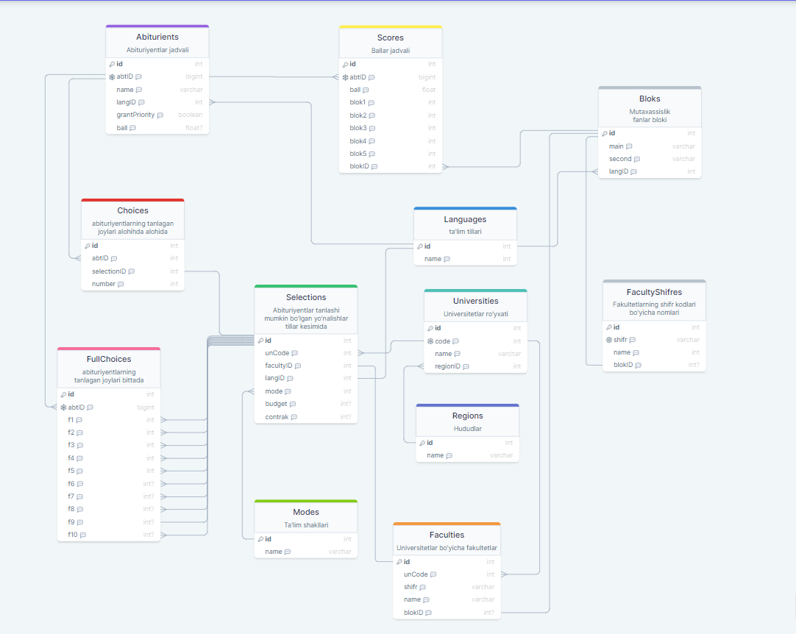
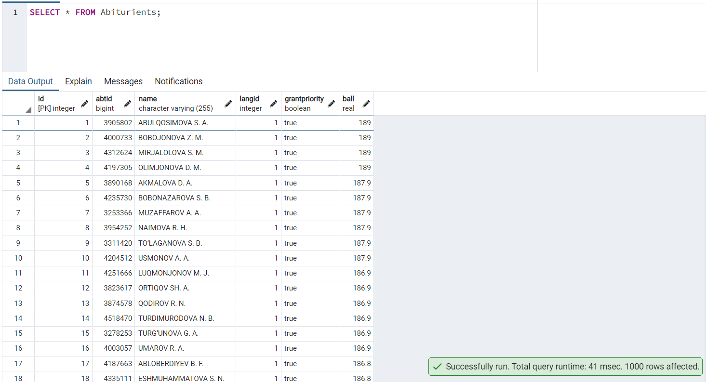
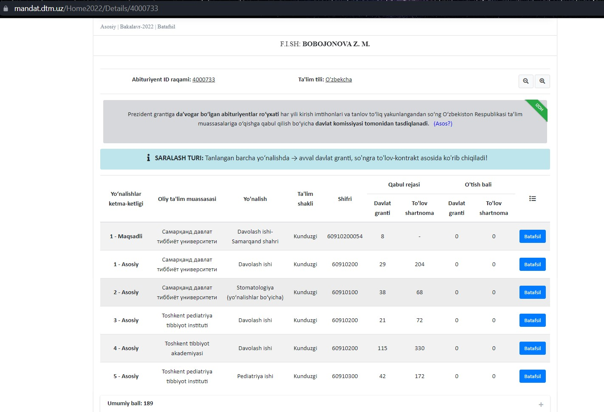
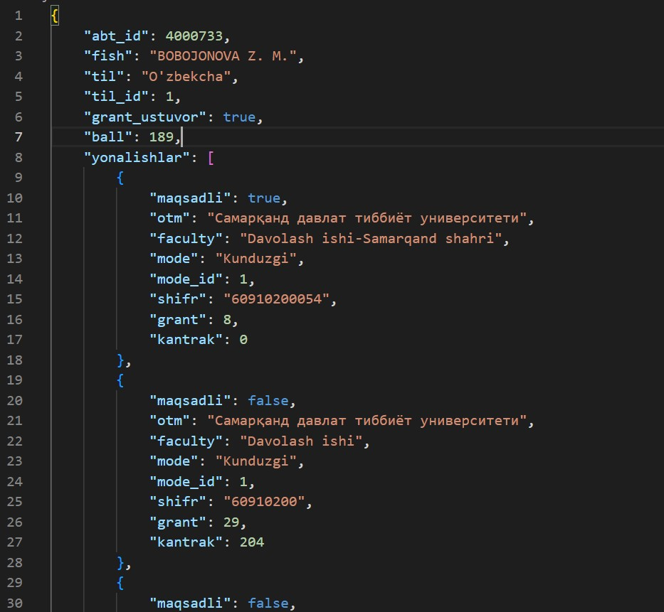
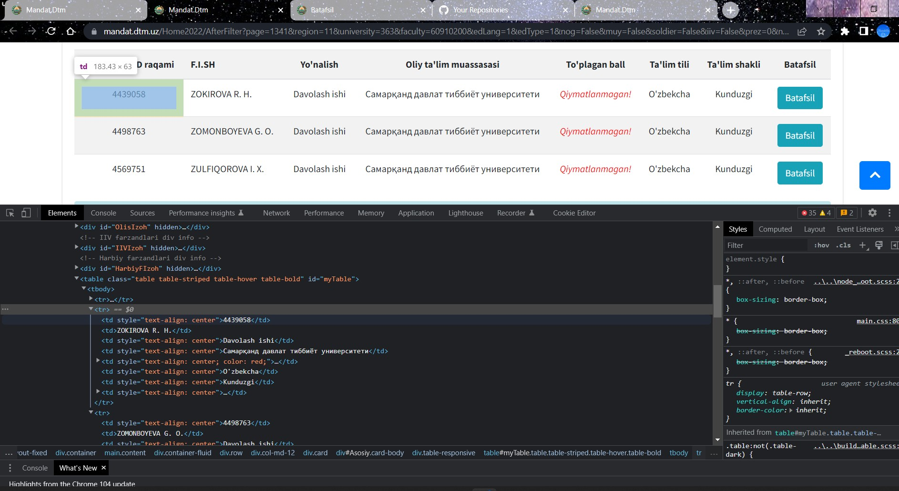

Mundarija:
- [O'rnatish](#ornatish)
    - [Kerakli dastur va kutubxonalar](#kerakli-dastur-va-kutubxonalar)
    - [Python kutubxonalari](#python-kutubxonalari)
    - [Konfiguratsiya uchun](#konfiguratsiya-uchun)
    - [Ma'lumotlar bazasini noldan qurish uchun](#malumotlar-bazasini-noldan-qurish-uchun)
- [Database](#database)
  - [Bazani clonlash](#bazani-clonlash)
  - [Structure](#structure)
  - [Bazada nimalar bor](#bazada-nimalar-bor)
- [Parser](#parser)
  - [Features](#features)
  - [Foydalanish](#foydalanish)
- [Xulosa](#xulosa)

# O'rnatish
### Kerakli dastur va kutubxonalar
* Python 3.8+
* PostgreSQL baza

<hr>

### Python kutubxonalari
 Parser, ma'lumotlar bazasi uchun kerakli python kutubxonalarni o'rnatish:
```bash
pip install -r requirements.txt
```
<hr>

### Konfiguratsiya uchun
Konfiguratsiya fayllarini `.env.dist `faylida namuna berilgan. Xuddi shunday namunaga qarab `.env` fayl oching. Ichiga ma'lumotlar bazasiga ulanish uchun 
* `DB_USER` -> Bazaga ulanish uchun username 
* `DB_PASS` -> Foydalanuvchi paroli
* `DB_HOST` -> Baza serveri
* `DB_NAME` -> Baza nomi
  
Avval manashularni taxlang. Bazagayam
 ```sql
CREATE DATABASE IF NOT EXISTS $DB_NAME$;
```
qilib keyin ulaning. Aytgancha Baza PostgreSQL bo'lsin.
<hr>

### Ma'lumotlar bazasini noldan qurish uchun
Agar ma'lumotlar bazasini noldan qurmoqchi bo'lsangiz `first_time_runner.py` faylini ishga tushiring. 
```bash
python first_time_runner.py
```
Shunda malumotlar bazasiga kerakli Table larni yaratib, boshlang'ich ma'lumotlar bilan to'ldiradi.


# Database

## Bazani clonlash
`dtm.sql` fayli ichida ma'lumotlar bazasidagi parsing qilib olingan ma'lumotlar bor.
`pg_dump` dan foydalanib chiqarilgan __backup__ fayl.
O'zizga clonlab olish uchun terminalga
```bash
psql -d <DB_NAME> -f dtm.sql -U <DB_USER>
```
deb yozing. `<DB_NAME>` o'rniga bazangiz uchun nom, masalan __DTM__ va `<DB_USER>` o'rniga o'zingizni psql foydalanuvchi username yingiz. Masalan `postgres` bo'lishi mumkin.

## Structure
SQL struktura 👉 [link](https://drawsql.app/teams/omadli/diagrams/dtm).


## Bazada nimalar bor
Baza hozircha bo'sh. Tets uchun 1000 ta abituriyent ma'lumotlari bor. Mediklardan. Abiturients jadvalida ko'rishiz mumkin.
```SQL
SELECT * FROM Abiturients;
```


<br/><br/>

# Parser

## Features

Parser asinxron ishlaydi!
Oddiygina `aiohttp` va `beautifulsoup4` kutubxonalaridan foydalanib. 


## Foydalanish

Foydalanish ham asinxron bo'lishi kerak. Namuna:
```python
import asyncio
from parser import DTM

abtID = 4000733

async def __main():
    p = DTM()
    await p.start()
    datas = dict(await p.User_detail(abtID))
    print(datas)
    await p.close()
    

if __name__ == '__main__':
    asyncio.run(__main())
```

User_detail() metodi kiritilgan abituriyent ID si bo'yicha uning `Home2022/Details/` + `abtID` sahifasidagi barcha ma'lumotlarini oladi.

Natija JSON (python dict) qaytaradi:



Bundan tashqari `Users_list()` metodi mandat saytidagi ro'yxatdan abturiyentlarni ID raqamlarini va balini oladi.
 Xuddi manashu yeridan oladi.

<br>
<br>

# Xulosa

Hozircha shular.
<br>
&copy; Omadli😎
